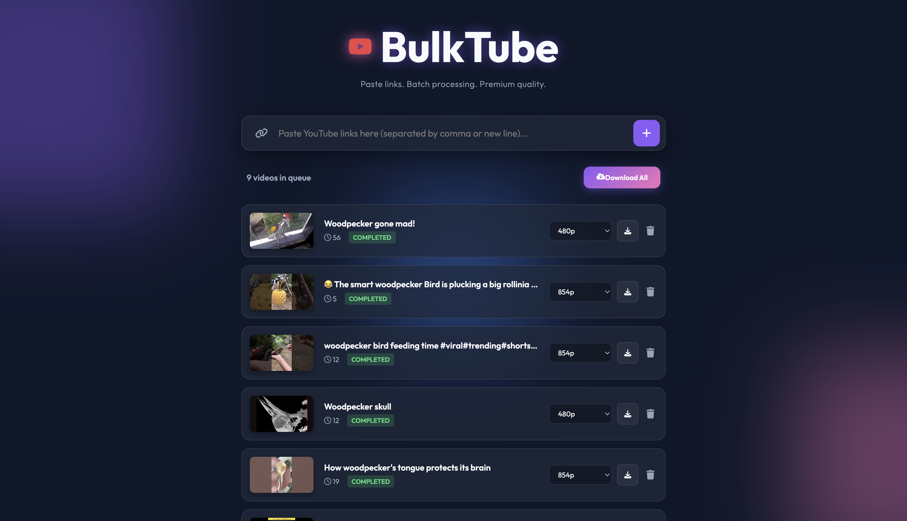

# BulkTube

**BulkTube** is a premium, locally-hosted YouTube downloader built with Python (Flask) and a modern Glassmorphism UI. It allows you to paste multiple links, select quality, and download videos in bulk using the powerful `yt-dlp` library.



## Features

- 🚀 **Bulk Processing**: Paste multiple links (comma or newline separated) to queue them up.
- 🎨 **Premium UI**: Beautiful Glassmorphism design with dark mode and smooth animations.
- 📱 **Mobile/Web Support**: Uses robust download clients to bypass YouTube restrictions (SABR/fragment errors).
- 🎛️ **Quality Control**: Select specific resolutions or let the app pick the best single-file format.
- 🛑 **Control**: Stop downloads mid-queue if needed.
- 🔒 **Privacy Focused**: Runs entirely locally on your machine. No external tracking.

## Prerequisites

- **Python 3.7+**
- **pip** (Python package manager)

## Installation

1. Clone or download this repository.
2. Navigate to the project folder:
   ```bash
   cd BulkTube
   ```
3. Run the startup script (macOS/Linux):
   ```bash
   chmod +x start.sh  # Only needed once to make it executable
   ./start.sh
   ```

   **Or manually:**
   ```bash
   pip3 install -r requirements.txt
   python3 app.py
   ```

## Usage

1. Open your browser to **`http://127.0.0.1:5001`**.
2. Paste YouTube links into the text area.
   - You can verify distinct videos by separating them with commas `,` or pressing Enter for new lines.
3. Click the **+** button to fetch metadata.
4. Select your desired quality for each video.
5. Click **Download All** to process the queue.
6. Find your videos in the `downloads` folder inside the project directory.

## Troubleshooting

- **Permissions Error**: If `./start.sh` says permission denied, run `chmod +x start.sh`.
- **Port In Use**: The app defaults to port `5001`. If it fails, check if another process is using it.

## Why "BulkTube"?

The project is named **BulkTube** because it specializes in handling **multiple video downloads in one go**. Whether you have a list of Shorts or a mix of music videos, you can paste them all at once and let BulkTube handle the batch processing for you.

## License & Copyright

**Copyright © 2026 Aakarsh.**

This project is licensed under the **MIT License**.
You are free to use, modify, and distribute this software. See the [LICENSE](LICENSE) file for more details.

